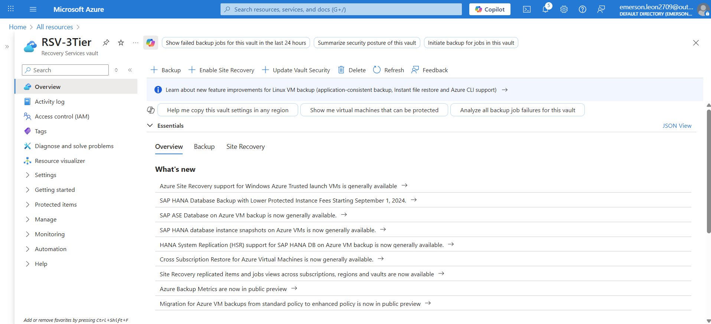
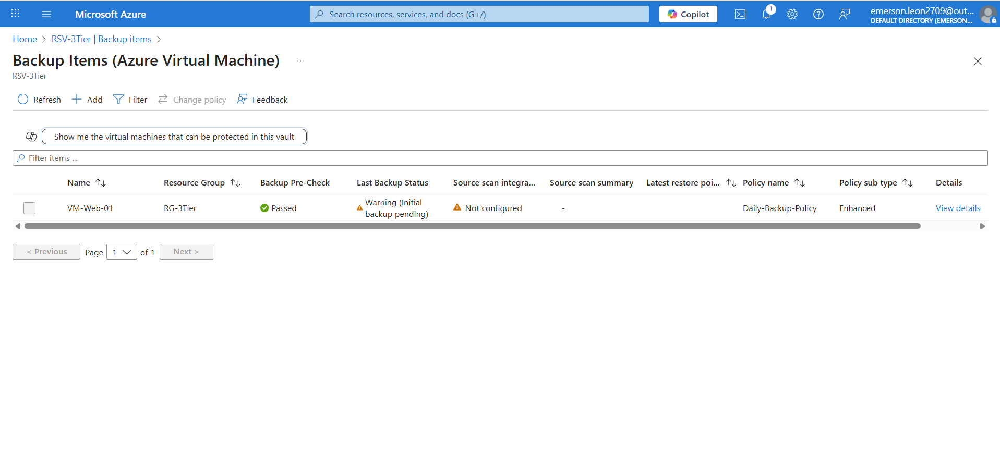
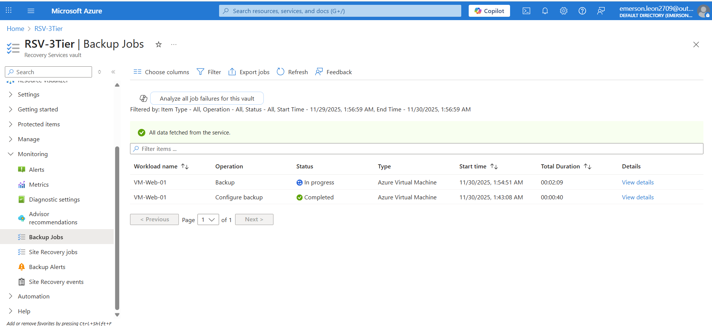
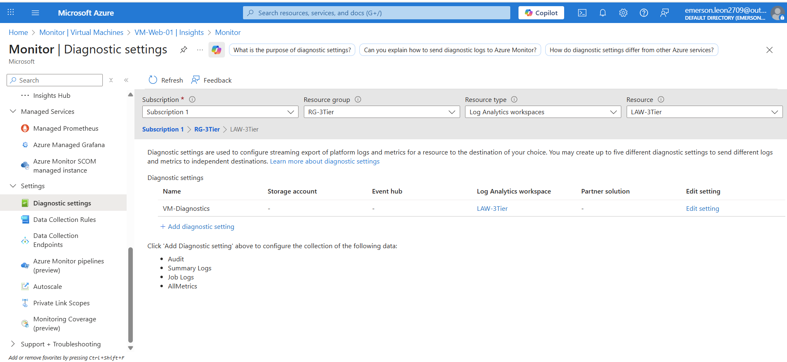

# Project 1 — Azure 3-Tier Network + VM + Backup

This project demonstrates the deployment of a secure 3-tier network architecture in Azure using Virtual Networks, Subnets, NSGs, Azure VM, Backup, and Monitoring.

## Architecture Overview
- VNet with 3 subnets: Web, App, Data
- NSGs controlling traffic between tiers
- A virtual machine hosted in the Web subnet
- Azure Backup using a Recovery Services Vault
- Monitoring with Azure Monitor + Alerts

## What This Project Covers
- Creating a VNet and subnets
- Deploying NSGs and rules
- Deploying and connecting a VM
- Configuring Backup
- Enabling monitoring and alerts
- Documenting the project with screenshots

## Screenshots

### Resource Group

### VNet + Subnets

### NSG-Web

### NSG-App

### Virtual Machine Overview

### VM Networking (Web Subnet)

### VM Effective Security Rules

### Recovery Services Vault Overview

### VM Backup Configuration

### Backup Job Status

### VM Diagnostic Settings

## ARM/Bicep Templates

## Notes/Learnings
